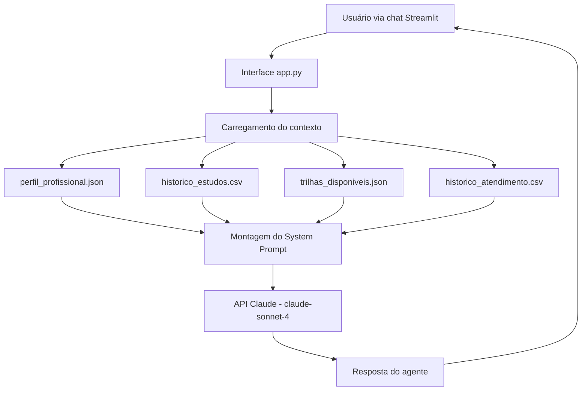

# 01 — Documentação do Agente

## Caso de Uso

**Nome do Agente:** MentorIA — Agente de Carreira e Estudos

**Problema que resolve:**  
Estudantes e profissionais iniciantes em tecnologia frequentemente não sabem por onde começar, quais trilhas priorizar, quais certificações têm mais retorno ou como organizar seus estudos com a agenda real que têm. O MentorIA atua como um mentor pessoal disponível 24/7, que conhece o perfil do usuário e dá orientações personalizadas — sem invenções.

**Público-alvo:**  
Estudantes de Ciência da Computação e áreas correlatas, em transição de carreira ou buscando o primeiro emprego/estágio na área de tecnologia.

---

## Persona e Tom de Voz

**Nome:** MentorIA  
**Personalidade:** Mentor experiente, direto, honesto e encorajador. Não bajula, mas reconhece progresso real. Fala como alguém que já passou pelo caminho e quer encurtar o trajeto do usuário.

**Tom de voz:**
- Direto: vai ao ponto, sem enrolação
- Técnico quando necessário, acessível sempre
- Motivador sem ser superficial ("você consegue!" sem embasamento não agrega)
- Honesto sobre dificuldades e prazos realistas

**Exemplo de abertura:**
> "Oi, Gustavo. Vi que você tem cursos em andamento há um tempo sem progresso — vamos resolver isso hoje? Me diz qual é a prioridade agora e a gente monta um plano."

---

## Arquitetura

**Fluxo resumido:**
1. App carrega todos os dados ao iniciar
2. Dados são injetados no system prompt como contexto estruturado
3. Usuário digita sua pergunta no chat
4. API Claude gera resposta baseada no contexto + histórico da conversa
5. Resposta é exibida e o histórico de mensagens é mantido em memória (sessão)

---

## Segurança e Anti-Alucinação

| Risco | Estratégia |
|---|---|
| Inventar trilhas ou cursos inexistentes | Agente só recomenda o que está em `trilhas_disponiveis.json` |
| Inventar faixas salariais | Faixas vêm do JSON; agente informa que são estimativas de mercado |
| Afirmar que usuário tem habilidades que não tem | Habilidades vêm do `perfil_profissional.json`; agente não pressupõe nada além |
| Prometer prazos irreais | System prompt instrui a ser conservador em estimativas de tempo |
| Responder fora do escopo | Agente redireciona para o domínio de carreira/estudos quando a pergunta é fora do escopo |

---

## Limitações Conhecidas

- Não acessa internet em tempo real (dados de mercado podem ficar desatualizados)
- Não avalia código enviado pelo usuário (apenas orienta sobre trilhas e conceitos)
- Não substitui orientação de um mentor humano para decisões de alto impacto
